# Sistema de Reglas de Optimización en Marketing Digital

## Fundamentos, Implementación y Estrategia

### Introducción

En el marketing digital moderno, la optimización manual de campañas se ha vuelto prácticamente imposible debido a:

-   La cantidad masiva de datos en tiempo real
-   Múltiples variables que afectan el rendimiento
-   Necesidad de ajustes constantes 24/7
-   Complejidad en la interacción entre diferentes variables

El sistema de reglas automatizadas resuelve esto mediante un enfoque sistemático y basado en datos.

### Fundamentos del Sistema


### Ecosistema GoAstra PRO Ads


### Jerarquía de Reglas

El sistema opera bajo una jerarquía clara basada en prioridades:
    


### Reglas Detalladas

## 1. Reglas de Protección

##### 1.1 Control de Presupuesto

**Objetivo**: Proteger la inversión y mantener el gasto bajo control.

**Lógica de Marketing**: El principio del control de costos es fundamental en marketing digital. Un gasto descontrolado puede arruinar el ROAS incluso con buenas conversiones.

**Funcionamiento**:


**Triggers**:

-   Gasto > 80% antes de tiempo previsto
-   Velocidad de gasto anormal
-   Picos súbitos de CPC

**Acciones**:

-   Reducción gradual de pujas
-   Pausa de segmentos costosos
-   Alertas al equipo

## 1.2 Control de ROAS/CPA

**Objetivo**: Mantener la rentabilidad de las campañas dentro de parámetros aceptables.

**Lógica de Marketing**: El equilibrio entre costo y retorno es crítico para la sostenibilidad de las campañas. Un CPA descontrolado puede hacer inviable una campaña incluso con alto volumen de conversiones.

```mermaid
graph TD
    A[Monitoreo ROAS] --> B{Evaluación}
    B -->|ROAS < Objetivo| C[Acciones Correctivas]
    B -->|ROAS > Objetivo| D[Oportunidad Escalado]
    
    C --> E[Reducir Pujas]
    C --> F[Optimizar Audiencias]
    C --> G[Revisar Creatividades]
    
    D --> H[Aumentar Presupuesto]
    D --> I[Expandir Alcance]
    
    style A fill:#f9f,stroke:#333,stroke-width:2px
    style B fill:#bbf,stroke:#333,stroke-width:2px
    style C fill:#fbb,stroke:#333,stroke-width:2px
    style D fill:#bfb,stroke:#333,stroke-width:2px
  ```

**Triggers**:

-   ROAS cae por debajo del 70% del objetivo
-   CPA supera en 30% el máximo permitido
-   Tendencia negativa sostenida por 48 horas

**Acciones Automáticas**:

1.  Nivel 1 (ROAS < 90% objetivo)
    -   Reducción de pujas en 10%
    -   Análisis de segmentos
2.  Nivel 2 (ROAS < 70% objetivo)
    -   Reducción de presupuesto 20%
    -   Pausa de peores segmentos
    -   Notificación al equipo

## 2. Reglas de Optimización de Creatividades

**Objetivo**: Mantener el rendimiento creativo óptimo y evitar la fatiga publicitaria.

**Lógica de Marketing**: La efectividad de las creatividades disminuye con el tiempo debido a la fatiga de audiencia. La rotación y optimización constante es crucial para mantener el rendimiento.

```mermaid
sequenceDiagram
    participant S as Sistema
    participant C as Creatividades
    participant P as Performance
    
    S->>C: Monitoreo CTR/CVR
    C->>P: Análisis de Rendimiento
    P->>S: Identificación de Fatiga
    S->>C: Rotación/Pausa
    C->>P: Nuevas Creatividades
    P->>S: Medición de Impacto
```

**Métricas Monitoreadas**:

-   CTR (Click-Through Rate)
-   CVR (Conversion Rate)
-   Engagement Rate
-   Relevance Score
-   Frequency

**Sistema de Rotación**:

1.  **Fase de Testing**:
    -   20% del presupuesto para nuevas creatividades
    -   Mínimo 1000 impresiones por creatividad
    -   Período de prueba de 48 horas
2.  **Fase de Optimización**:
    -   Pausa automática de bajo rendimiento
    -   Escalado de mejores performers
    -   Generación de variaciones

## 3. Reglas de Escalado Inteligente

**Objetivo**: Maximizar el crecimiento manteniendo la eficiencia.

**Lógica de Marketing**: El escalado debe ser gradual y controlado para mantener la eficiencia. Un escalado demasiado agresivo puede saturar audiencias y reducir el rendimiento.


**Condiciones para Escalado**:

1.  **Métricas Base**:
    -   ROAS > 130% del objetivo
    -   CPA < 85% del máximo
    -   Volumen mínimo de conversiones
2.  **Salud de Campaña**:
    -   Frequency < 2.5
    -   CTR estable
    -   Audience saturation < 40%

**Protocolo de Escalado**:
1.  **Incremento de Presupuesto**:
        
    Fase 1: +20% → Monitor 48h
    Si éxito → Fase 2: +30% → Monitor 48h
    Si éxito → Fase 3: +50% → Monitor 72h
    
2.  **Expansión de Audiencia**:
    -   Creación de lookalikes expandidos
    -   Testing de intereses relacionados
    -   Expansión geográfica controlada

## 4. Reglas de Optimización Horaria

**Objetivo**: Maximizar la eficiencia según patrones temporales de rendimiento.

**Lógica de Marketing**: El comportamiento del usuario varía significativamente según la hora y día, afectando tanto los costos como las conversiones.


## 5. Reglas de Optimización de Audiencias

**Objetivo**: Mantener audiencias efectivas y descubrir nuevos segmentos rentables.

**Lógica de Marketing**: La calidad y relevancia de las audiencias es fundamental para el rendimiento de las campañas. La saturación y el desgaste de audiencias requieren una renovación constante.


**Métricas de Control**:

1.  **Salud de Audiencia**:
    -   Frecuencia de exposición
    -   Tasa de saturación
    -   CTR por segmento
    -   CVR por segmento
2.  **Triggers de Optimización**:
	

    Saturación > 65% → Expansión
    CTR < 0.8% → Refinamiento
    Frecuencia > 3 → Rotación


## 6. Reglas de Competencia y Mercado

**Objetivo**: Mantener competitividad y adaptar estrategias según condiciones de mercado.

**Lógica de Marketing**: Las condiciones de mercado y la actividad de la competencia afectan directamente los costos y la efectividad de las campañas.


**Variables Monitoreadas**:

-   CPM por segmento
-   Share of Voice
-   Posición de anuncio
-   Costos relativos

**Acciones Automáticas**:

1.  **Ajustes Competitivos**:
    -   Incremento de pujas en horas pico
    -   Ajuste de presupuestos por competitividad
    -   Rotación de creatividades
2.  **Adaptación de Mercado**:
CPM +30% → Ajuste de targeting
SOV < 15% → Revisión de estrategia
Position < 3 → Incremento de pujas


## 7. Reglas de Testing Automático

**Objetivo**: Descubrir y validar nuevas oportunidades de optimización.

**Lógica de Marketing**: El testing continuo es esencial para encontrar nuevas oportunidades de mejora y mantener la competitividad.


**Sistema de Testing**:

1.  **Áreas de Test**:
    -   Creatividades
    -   Audiencias
    -   Copys
    -   Objetivos de optimización
    -   Formatos de anuncio
2.  **Protocolo de Testing**:
	Presupuesto: 10-15% del total
Duración mínima: 72 horas
Volumen mínimo: 1000 impresiones
Confianza estadística: 95%


## 8. Reglas de Valor Lifetime

**Objetivo**: Optimizar hacia el valor a largo plazo del cliente.

**Lógica de Marketing**: El valor real de un cliente va más allá de la primera conversión. La optimización debe considerar el potencial de valor lifetime.


**Métricas LTV**:

-   Valor promedio por cliente
-   Frecuencia de compra
-   Tasa de retención
-   Potencial de cross-selling

**Estrategias de Optimización**:

1.  **Segmentación por Valor**
Alto Valor: +30% en pujas
Medio Valor: Mantener
Bajo Valor: -20% en pujas


1.  **Acciones Automáticas**:
    -   Creación de lookalikes de alto valor
    -   Ajuste de pujas por segmento de valor
    -   Optimización de creatividades por tipo de cliente

## 9. Reglas de Calidad de Tráfico

**Objetivo**: Asegurar la calidad del tráfico y prevenir fraude.

**Lógica de Marketing**: La calidad del tráfico impacta directamente en el ROI. Es crucial identificar y eliminar fuentes de tráfico no deseado.


**Indicadores de Calidad**:

-   Tiempo en sitio
-   Tasa de rebote
-   Patrones de navegación
-   Comportamiento de conversión

**Acciones de Protección**:

1.  **Filtros Automáticos**:
    -   Exclusión de IPs sospechosas
    -   Bloqueo de patrones anómalos
    -   Ajuste de targeting por calidad
2.  **Optimización de Calidad**:
Bounce Rate > 80% → Investigar
Tiempo en sitio < 10s → Revisar
Conversiones sospechosas → Pausar


## 10. Reglas de Estacionalidad

**Objetivo**: Anticipar y adaptar las campañas a patrones estacionales y eventos especiales.

**Lógica de Marketing**: Los comportamientos de compra y costos publicitarios varían significativamente según temporadas y eventos. La anticipación y adaptación son clave para la eficiencia.


**Sistema de Predicción**:

1.  **Análisis Temporal**:
    -   Patrones anuales
    -   Patrones mensuales
    -   Eventos específicos
    -   Comportamiento histórico
**Ajustes Automáticos**:

Temporada Alta:
- Incremento presupuesto: +50-100%
- Expansión de audiencias
- Creatividades específicas

Temporada Baja:
- Reducción presupuesto: -30-50%
- Enfoque en retención
- Optimización de costos


## 11. Reglas de Remarketing Avanzado

**Objetivo**: Maximizar el valor del tráfico existente mediante estrategias de remarketing personalizadas.

**Lógica de Marketing**: Diferentes comportamientos de usuarios requieren diferentes estrategias de remarketing. La personalización y timing son cruciales.


**Segmentación por Comportamiento**:
-   **Visitantes de Producto**:    

	    0-24h: Mensaje urgencia
	    24-72h: Ofertas específicas
	    72h+: Contenido valor agregado

    
-   **Abandonos de Carrito**:        

		  0-4h: Recordatorio simple 
		  4-24h: Incentivo pequeño 
		  24h+: Incentivo mayor

    
-   **Post-Compra**:   

		   0-7d: Cross-selling 
		   7-30d: Reactivación 
		   30d+: Fidelización


## 12. Reglas Cross-Channel

**Objetivo**: Optimizar la sinergia entre diferentes canales publicitarios.

**Lógica de Marketing**: Los canales no operan de forma aislada. La optimización debe considerar el impacto y la interacción entre canales.


**Estrategias de Optimización**:

1.  **Atribución Multi-Canal**:
    -   Modelos personalizados
    -   Análisis de path to conversion
    -   Valor por touchpoint
2.  **Distribución Dinámica**:
        
		    Canal A > 150% ROAS → +20% presupuesto 
		    Canal B < 80% ROAS → -15% presupuesto 
		    Sinergia A+B → Mantener ambos
    

## 13. Sistema de Alertas Avanzadas

**Objetivo**: Proporcionar monitoreo proactivo y alertas inteligentes para prevenir problemas y capturar oportunidades.

**Lógica de Marketing**: La detección temprana de problemas y oportunidades es crucial para el rendimiento de las campañas.


**Niveles de Alerta**:

1.  **Alertas Críticas (Rojas)**: 
    
    - Gasto > 150% promedio 
    - ROAS < 50% objetivo 
    - CPA > 200% objetivo 
    - Caída CTR > 50%`
    
2.  **Alertas de Riesgo (Amarillas)**:   

    
    - Tendencia negativa 48h 
    - Frequency > 4 
    - Saturación > 70% 
    - Competencia +40%`
    
3.  **Alertas de Oportunidad (Verdes)**:    
    - ROAS > 150% objetivo 
    - CTR > 150% promedio 
    - CPCs -30% 
    - Nuevos segmentos rentables
    

**Sistema de Notificación**:

-   Alertas en tiempo real
-   Priorización inteligente
-   Recomendaciones de acción
-   Seguimiento de resolución


# Sistema Automatizado vs Trafficker Humano

## Análisis Comparativo Detallado

### 1. Comparativa de Tiempos Operativos

```mermaid
gantt
    title Día Típico: Trafficker vs Sistema
    dateFormat  HH:mm
    axisFormat %H:%M
    
    section Trafficker
    Revisión inicial     :a1, 09:00, 1h
    Optimización manual  :a2, 10:00, 2h
    Ajustes creatividades:a3, 12:00, 1h
    Reportes            :a4, 14:00, 1h
    Revisión tarde      :a5, 16:00, 1h
    
    section Sistema
    Monitoreo continuo  :b1, 00:00, 24h
    Optimización auto   :b2, 00:00, 24h
    Reportes auto      :b3, 00:00, 24h
```





```mermaid
graph LR
    A[Capacidad de Procesamiento] --> B[Trafficker]
    A --> C[Sistema]
    
    B --> D[5-10 campañas/hora]
    B --> E[100-200 decisiones/día]
    
    C --> F[Miles campañas/minuto]
    C --> G[Millones decisiones/día]
    
    style A fill:#f9f,stroke:#333,stroke-width:2px
    style B fill:#bbf,stroke:#333,stroke-width:2px
    style C fill:#bfb,stroke:#333,stroke-width:2px
 ```


| Actividad               | Trafficker | Goastra PRO Trafficker        | Ventaja     |
|-------------------------|------------|-------------------------------|-------------|
| Detección de anomalías  | 2-4 horas  | Instantáneo                   | Goastra PRO |
| Ajustes de presupuestos | 15-30 mins | Instantáneo                   | Goastra PRO |
| Optimización de pujas   | 1-2 horas  | Continuo e instantáneo        | Goastra PRO |
| Análiosis creativo      | 30 - 30min | Análisis continuo             | Goastra PRO |
| Decisiones estratégicas | Variable   | Basado en reglas, instantáneo | Goastra Pro |

3.2 Escala de Operaciones
```mermaid
graph TD
    A[Capacidad de Gestión] --> B[Trafficker]
    A --> C[Sistema]
    
    B --> D[10-20 cuentas]
    B --> E[50-100 campañas]
    
    C --> F[Ilimitadas cuentas]
    C --> G[Ilimitadas campañas]
    
    style A fill:#f9f,stroke:#333,stroke-width:2px
    style B fill:#bbf,stroke:#333,stroke-width:2px
    style C fill:#bfb,stroke:#333,stroke-width:2px
 ```

### 4. Análisis de Fortalezas y Debilidades

## 4.1 Sistema Automatizado

**Fortalezas**:

-   Monitoreo 24/7
-   Procesamiento masivo de datos
-   Respuesta instantánea
-   Consistencia en decisiones
-   Escalabilidad infinita
-   Sin fatiga o error humano

**Limitaciones**:

-   Creatividad limitada
-   Menor adaptabilidad a cambios drásticos
-   Dependencia de datos históricos
-   Rigidez en situaciones no programadas

## 4.2 Trafficker Humano

**Fortalezas**:

-   Pensamiento estratégico
-   Creatividad e intuición
-   Adaptabilidad a situaciones nuevas
-   Comprensión de contexto
-   Toma de decisiones complejas

**Limitaciones**:

-   Capacidad limitada de procesamiento
-   Fatiga y error humano
-   Tiempo de respuesta lento
-   Inconsistencia en decisiones
-   Limitación de horario laboral

### 5. Impacto en Resultados

```mermaid
graph TD
    A[Métricas de Rendimiento] --> B[KPIs Operativos]
    A --> C[KPIs de Resultados]
    
    B --> D[Tiempo de Gestión]
    B --> E[Capacidad de Procesamiento]
    B --> F[Velocidad de Respuesta]
    
    C --> G[ROAS]
    C --> H[CPA]
    C --> I[Escalabilidad]
    
    style A fill:#f9f,stroke:#333,stroke-width:2px
    style B fill:#bbf,stroke:#333,stroke-width:2px
    style C fill:#bfb,stroke:#333,stroke-width:2px
```

### 6. ROI del Sistema

## 6.1 Costos Operativos


## 6.2 Beneficios Financieros

-   Reducción de costos operativos: 60-70%
-   Mejora en eficiencia: 30-40%
-   Incremento en capacidad: 1000%+
-   ROI del sistema: 300-400%


# Plan de Desarrollo: Sistema de Automatización Publicitaria

## Estimación de Tiempos y Recursos

### 1. Visión General del Proyecto


