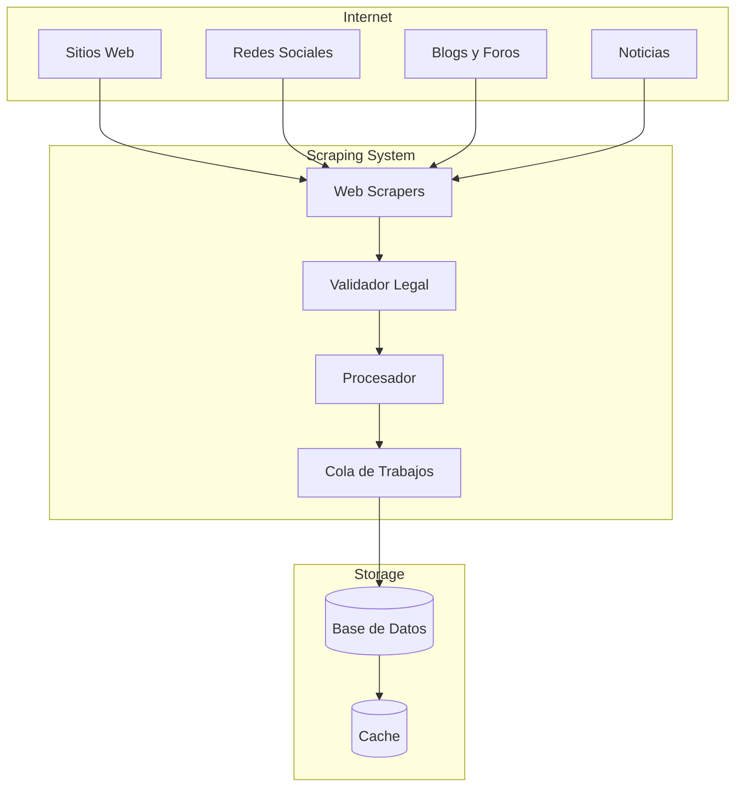
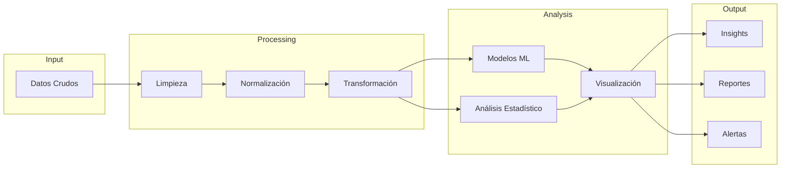
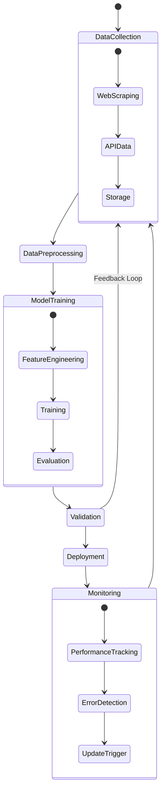
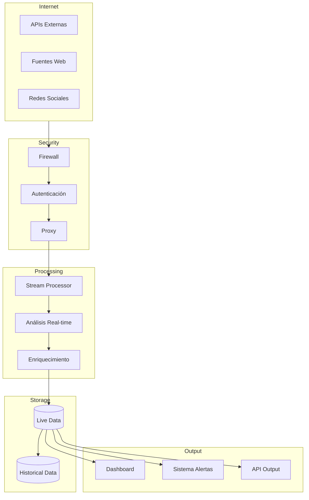

# Sistema Automatizado de Estudios de Mercado Utilizando LLMs y Modelos de Inteligencia Artificial con Datos Actualizados

## Introducción

En el entorno empresarial contemporáneo, donde la información se actualiza y expande a un ritmo sin precedentes, contar con datos precisos y actuales es esencial para mantener una ventaja competitiva. Los estudios de mercado tradicionales, aunque valiosos, a menudo se quedan rezagados debido a la rapidez con la que evoluciona el mercado. Las herramientas basadas en inteligencia artificial, como ChatGPT, tienen limitaciones significativas porque se basan en datos de entrenamiento que pueden estar desactualizados, lo que impide obtener insights relevantes y oportunos.

**Problema Identificado:** Al utilizar plataformas de inteligencia artificial como ChatGPT, nos enfrentamos al desafío de que los datos no reflejan las condiciones actuales del mercado. Esto limita nuestra capacidad para entender el panorama competitivo, identificar oportunidades emergentes y responder eficazmente a las estrategias de la competencia.

## Objetivo

Desarrollar un sistema automatizado que realice estudios de mercado utilizando modelos de lenguaje de gran tamaño (LLMs) y modelos de inteligencia artificial propios, alimentados con datos actualizados. Este sistema permitirá:

-   **Comprender profundamente el mercado actual.**
-   **Analizar el comportamiento de los clientes y sus necesidades.**
-   **Monitorear y anticipar las acciones de los competidores.**
-   **Identificar tendencias y oportunidades emergentes.**
-   **Tomar decisiones estratégicas basadas en información en tiempo real.**

## Solución Propuesta

Crear un sistema integral que combina varias tecnologías y métodos para recopilar, procesar y analizar datos de mercado actualizados. Esto se logrará mediante:

1.  **Web Scraping Automatizado:** Recolección de datos en tiempo real de fuentes en línea relevantes.
2.  **Bases de Datos Actualizadas:** Almacenamiento estructurado y eficiente de la información recopilada.
3.  **Desarrollo de Modelos de IA Personalizados:** Entrenamiento de modelos propios con datos actualizados.
4.  **Conexión a Internet en Tiempo Real:** Integración continua para mantener la información al día.

## Beneficios del Sistema

### Información Actualizada y Relevante

-   **Datos en Tiempo Real:** Acceso a información actualizada que refleja las condiciones actuales del mercado.
-   **Análisis Preciso:** Reducción de errores y suposiciones basadas en datos obsoletos.

### Comprensión Profunda del Mercado

-   **Análisis de Tendencias:** Identificación de tendencias emergentes y cambios en el comportamiento del consumidor.
-   **Inteligencia Competitiva:** Monitoreo constante de las acciones y estrategias de los competidores.
-   **Segmentación de Mercado:** Comprensión detallada de diferentes segmentos de clientes y sus necesidades específicas.

### Ventaja Competitiva

-   **Decisiones Informadas:** Capacidad para tomar decisiones estratégicas basadas en información precisa y actual.
-   **Adaptabilidad y Agilidad:** Respuesta rápida a cambios en el mercado y ajustes en las estrategias de la competencia.
-   **Innovación Continua:** Identificación de nuevas oportunidades para productos y servicios.

### Eficiencia Operativa

-   **Automatización de Procesos:** Ahorro de tiempo y recursos al automatizar la recolección y análisis de datos.
-   **Reducción de Costos:** Menor dependencia de estudios de mercado externos y consultorías.

### Personalización y Escalabilidad

-   **Modelos de IA Adaptados:** Desarrollo de modelos que reflejan las necesidades específicas de la empresa.
-   **Crecimiento Sostenible:** Capacidad para escalar el sistema según las necesidades cambiantes del negocio.

## Resultados Potenciales de un Estudio de Mercado Automatizado

-   **Identificación de Nuevos Nichos de Mercado:** Descubrimiento de áreas con alto potencial de crecimiento.
-   **Análisis Competitivo Detallado:** Información sobre las fortalezas y debilidades de los competidores.
-   **Predicción de Comportamiento del Consumidor:** Anticipación de las necesidades y deseos de los clientes.
-   **Optimización de Estrategias de Marketing:** Diseño de campañas más efectivas y dirigidas.
-   **Mejora en la Toma de Decisiones:** Datos sólidos que respaldan decisiones estratégicas y tácticas.

## Componentes del Sistema

### 1. Recolección de Datos (Web Scraping)

#### Descripción

La recolección de datos es fundamental para mantener el sistema actualizado. Se utilizarán técnicas de web scraping para extraer información de:

-   **Sitios Web de la Competencia:** Información sobre nuevos productos, promociones y estrategias.
-   **Redes Sociales:** Opiniones y comentarios de clientes, tendencias virales.
-   **Blogs y Foros Especializados:** Insights de expertos y comunidades específicas.
-   **Noticias y Publicaciones:** Actualizaciones sobre el mercado y la industria.

#### Proceso

-   **Automatización:** Uso de bots y scripts para extraer datos de forma continua.
-   **Eficiencia:** Optimización de los procesos para minimizar el tiempo y los recursos necesarios.
-   **Cumplimiento Legal:** Asegurar que la recolección de datos respete las políticas y regulaciones vigentes.

### 2. Almacenamiento y Procesamiento de Datos

#### Almacenamiento

-   **Bases de Datos Escalables:** Sistemas que permiten manejar grandes volúmenes de información.
-   **Estructuración de Datos:** Organización de los datos para facilitar su acceso y análisis.

#### Procesamiento

-   **Limpieza de Datos:** Eliminación de duplicados y corrección de errores.
-   **Análisis Preliminar:** Identificación de patrones y tendencias iniciales.
-   **Preparación para el Modelado:** Formateo y transformación de datos para el entrenamiento de modelos de IA.

    
### 3. Desarrollo de Modelos de IA Personalizados

#### Selección del Modelo

-   **Modelos de Lenguaje de Gran Tamaño (LLMs):** Adaptados a las necesidades específicas del mercado.
-   **Algoritmos de Aprendizaje Automático:** Para clasificar y predecir comportamientos.

#### Entrenamiento

-   **Datos Actualizados:** Uso de los datos más recientes para asegurar la relevancia del modelo.
-   **Iteración Continua:** Mejora constante del modelo mediante reentrenamiento con nuevos datos.

#### Validación

-   **Pruebas Rigurosas:** Asegurar que el modelo funciona correctamente y proporciona insights precisos.
-   **Feedback Loop:** Incorporación de retroalimentación para mejorar el desempeño del modelo.

### 4. Conexión a Internet en Tiempo Real

#### Integración Continua

-   **Actualizaciones Periódicas:** El sistema se actualiza automáticamente con nuevos datos.
-   **Monitoreo en Tiempo Real:** Capacidad para detectar y reaccionar a eventos en el momento en que ocurren.

#### Seguridad

-   **Protocolos Seguros:** Protección de datos y comunicaciones.
-   **Cumplimiento Normativo:** Asegurar que todas las actividades cumplen con las regulaciones aplicables.

## Plan de Implementación

### Paso 1: Definir los Requisitos

-   **Objetivos Específicos:** Establecer qué se espera lograr con el sistema.
-   **Identificación de Fuentes de Datos:** Seleccionar las fuentes más relevantes y confiables.
-   **Criterios de Éxito:** Definir cómo se medirá el éxito del sistema.

### Paso 2: Desarrollo del Módulo de Web Scraping

-   **Herramientas y Tecnologías:** Selección de tecnologías adecuadas (por ejemplo, Python, Beautiful Soup, Scrapy).
-   **Diseño de Scripts Personalizados:** Adaptados a las estructuras de los sitios web objetivo.
-   **Pruebas y Validación:** Asegurar que los datos se recolectan correctamente y de manera eficiente.

### Paso 3: Configuración de la Base de Datos

-   **Selección del Sistema de Gestión de Bases de Datos:** Considerando necesidades de escalabilidad y rendimiento.
-   **Diseño de Esquemas de Datos:** Estructuración que facilite el acceso y análisis.
-   **Implementación de Medidas de Seguridad:** Protección contra accesos no autorizados y pérdida de datos.

### Paso 4: Entrenamiento del Modelo de IA

-   **Preparación de Datos:** Formateo y limpieza de datos para el entrenamiento.
-   **Configuración de Parámetros:** Ajuste de hiperparámetros para optimizar el rendimiento.
-   **Evaluación y Mejora:** Uso de métricas para evaluar el modelo y realizar mejoras.

### Paso 5: Integración y Automatización

-   **Desarrollo de APIs y Conexiones:** Para integrar los diferentes componentes del sistema.
-   **Automatización de Procesos:** Programación de tareas para ejecutar procesos sin intervención manual.
-   **Interfaz de Usuario:** Desarrollo de dashboards y herramientas para visualizar los resultados.

### Paso 6: Pruebas y Validación

-   **Pruebas Unitarias y de Integración:** Asegurar que cada componente y el sistema en conjunto funcionan correctamente.
-   **Validación de Resultados:** Comparar los resultados con estudios de mercado existentes para verificar la precisión.

### Paso 7: Despliegue y Mantenimiento

-   **Implementación en Producción:** Migración del sistema al entorno operativo.
-   **Monitoreo Continuo:** Seguimiento del rendimiento y detección de posibles problemas.
-   **Actualizaciones y Soporte:** Mantenimiento regular y mejora continua del sistema.

## Casos de Uso y Aplicaciones Prácticas

### Análisis del Comportamiento del Cliente

-   **Segmentación de Mercado:** Identificación de grupos de clientes con características y necesidades similares.
-   **Personalización de Ofertas:** Adaptación de productos y servicios a las preferencias de los clientes.
-   **Fidelización:** Desarrollo de estrategias para aumentar la retención y satisfacción del cliente.

### Monitoreo de Competidores

-   **Seguimiento de Estrategias:** Observación de las tácticas y movimientos de los competidores.
-   **Análisis Comparativo:** Evaluación de fortalezas y debilidades en relación con la competencia.
-   **Anticipación de Movimientos:** Predicción de posibles acciones futuras de los competidores.

### Identificación de Tendencias del Mercado

-   **Análisis de Sentimiento:** Evaluación de opiniones y percepciones en redes sociales y foros.
-   **Predicción de Demanda:** Estimación de la demanda futura de productos y servicios.
-   **Innovación de Productos:** Desarrollo de nuevas ofertas basadas en necesidades emergentes.

## Consideraciones Adicionales

### Ética y Legalidad

-   **Cumplimiento de Regulaciones:** Asegurar que todas las actividades cumplen con leyes como GDPR y otras normativas locales.
-   **Consentimiento y Privacidad:** Respetar la privacidad de los usuarios y obtener los consentimientos necesarios.
-   **Transparencia:** Ser claro sobre cómo se utilizan los datos y para qué fines.

### Seguridad de Datos

-   **Protección Contra Amenazas:** Implementar medidas para prevenir ataques cibernéticos.
-   **Respaldo de Información:** Realizar copias de seguridad periódicas para evitar pérdida de datos.
-   **Control de Acceso:** Gestionar quién tiene acceso a qué información dentro de la organización.

### Colaboración Interdepartamental

-   **Integración con Otros Sistemas:** Asegurar que el sistema puede comunicarse con otras herramientas utilizadas en la empresa.
-   **Formación y Capacitación:** Asegurar que el personal entiende y puede utilizar el sistema eficazmente.
-   **Feedback Continuo:** Establecer canales para recibir retroalimentación y mejorar el sistema.

## Conclusión

La implementación de un sistema automatizado de estudios de mercado utilizando LLMs y modelos de inteligencia artificial propios con datos actualizados representa una oportunidad estratégica para nuestra empresa. Al superar las limitaciones de las herramientas actuales y aprovechar tecnologías avanzadas, podemos:

-   **Comprender el mercado en profundidad y en tiempo real.**
-   **Tomar decisiones informadas que impulsen el crecimiento y la competitividad.**
-   **Anticiparnos a las tendencias y movimientos de la competencia.**
-   **Optimizar nuestras estrategias de negocio y marketing.**

Este sistema no solo mejorará nuestra capacidad para analizar el mercado, sino que también nos permitirá innovar y adaptarnos rápidamente a los cambios, manteniendo una ventaja competitiva significativa.
