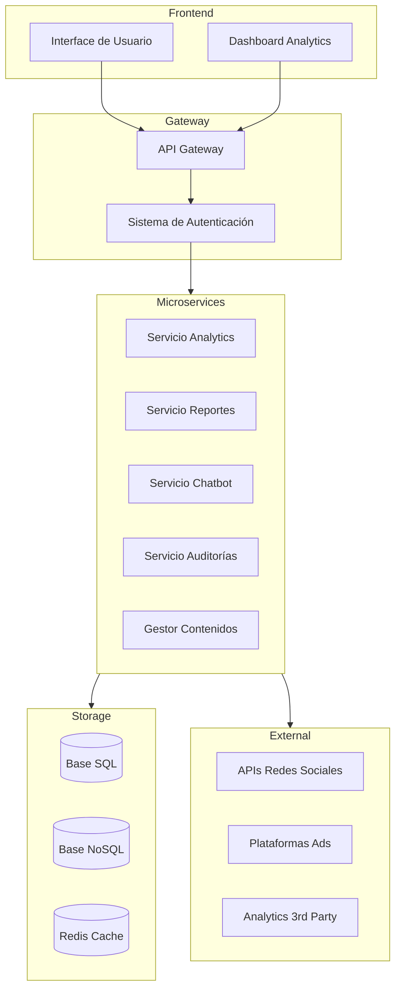
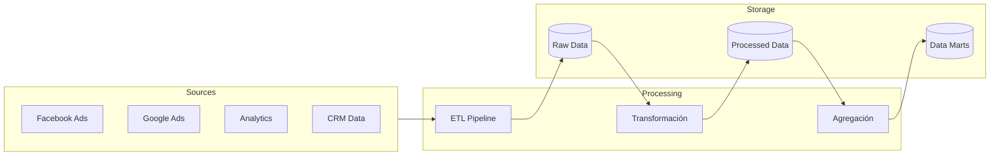
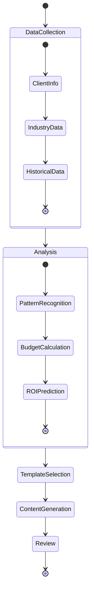

# Sistema Integral de Automatización para Agencia Digital 🚀

## Introducción

Este documento presenta un sistema integral diseñado para transformar una agencia de marketing digital tradicional en una operación altamente escalable y automatizada. El objetivo es multiplicar la capacidad operativa sin incrementar proporcionalmente el personal, manteniendo y mejorando la calidad del servicio.

## Sistemas Propuestos

### 1. Dashboard Analytics Centralizado 📊

**¿Qué es y para qué sirve?** Un centro de comando que unifica todos los datos de marketing en una sola interfaz. Imagina tener Facebook Ads, Google Ads, Analytics y datos de CRM en una sola pantalla, actualizándose en tiempo real. En lugar de perder horas compilando reportes de diferentes plataformas, tendrás toda la información crítica disponible instantáneamente.

**Caso práctico:** Cuando un cliente pregunta sobre el rendimiento de sus campañas, en lugar de entrar a 5 plataformas diferentes y crear un reporte manual, abres el dashboard y tienes toda la información lista. Si una campaña empieza a bajo-rendir, el sistema te alerta automáticamente, permitiéndote ser proactivo en lugar de reactivo.

**Beneficio real:** Una agencia usando este sistema redujo el tiempo de reporting de 4 horas por cliente a 15 minutos, permitiéndoles gestionar el triple de cuentas con el mismo equipo.

### 2. Sistema de Propuestas Automatizadas 📝

**¿Qué es y para qué sirve?** Un sistema inteligente que genera propuestas comerciales personalizadas basadas en datos históricos y patrones de éxito. No más propuestas genéricas o partir de cero cada vez - el sistema aprende de cada caso y mejora continuamente.

**Caso práctico:** Cuando llega un lead de una empresa de e-commerce de moda, el sistema:

1.  Analiza casos similares previos
2.  Identifica qué estrategias funcionaron mejor
3.  Genera una propuesta personalizada con casos de éxito relevantes
4.  Calcula presupuestos basados en resultados anteriores
5.  Incluye predicciones de ROI basadas en datos reales

### 3. Bot de Atención al Cliente Inteligente 🤖

**¿Qué es y para qué sirve?** No es un simple chatbot de respuestas predefinidas, sino un asistente inteligente que maneja las consultas de primer nivel y aprende continuamente. Esto libera a tu equipo para enfocarse en tareas estratégicas mientras mantiene a los clientes satisfechos 24/7.

**Caso práctico:** Un cliente necesita actualizar una campaña a las 10 PM:

1.  El bot recibe la solicitud
2.  Identifica el tipo de cambio requerido
3.  Si es simple (ej. ajuste de presupuesto), lo ejecuta automáticamente
4.  Si es complejo, programa una respuesta prioritaria para la mañana siguiente
5.  Mantiene al cliente informado en todo momento

### 4. Sistema de Auditorías Automatizadas 🔍

**¿Qué es y para qué sirve?** Un sistema que realiza auditorías profundas y continuas de SEO, rendimiento web y presencia digital. En lugar de auditorías puntuales cada varios meses, tienes un monitoreo constante que identifica problemas y oportunidades en tiempo real.

**Caso práctico:** El sistema monitorea continuamente los sitios de tus clientes:

1.  Detecta caídas de rendimiento inmediatamente
2.  Identifica oportunidades de keywords antes que la competencia
3.  Alerta sobre problemas técnicos antes que afecten el SEO
4.  Genera informes de oportunidades priorizados por impacto potencial

### 5. Plataforma de Gestión de Contenidos Inteligente 📱

**¿Qué es y para qué sirve?** Va más allá de un simple calendario editorial. Es un sistema integral que no solo programa contenido, sino que analiza su rendimiento, sugiere mejoras y optimiza los tiempos de publicación basándose en datos reales de engagement.

**Caso práctico:** Para cada pieza de contenido, el sistema:

1.  Analiza el rendimiento histórico de contenidos similares
2.  Sugiere los mejores momentos para publicar
3.  Recomienda hashtags y formatos basados en datos
4.  Detecta tendencias emergentes en tu nicho
5.  Mide el impacto y ajusta la estrategia automáticamente

### 6. Monitor de Reputación Online 👥

**¿Qué es y para qué sirve?** Un sistema que va más allá del simple monitoreo de menciones. Analiza el sentimiento, identifica patrones y predice posibles crisis antes de que escalen. Es como tener un equipo de PR 24/7 monitoreando todas las conversaciones relevantes.

**Caso práctico:** El sistema constantemente:

1.  Analiza menciones en todas las plataformas
2.  Evalúa el sentimiento de los comentarios
3.  Identifica influencers y detractores
4.  Alerta sobre cambios significativos en la percepción
5.  Sugiere acciones basadas en situaciones similares previas

### 7. Sistema Predictivo de Upselling 💰

**¿Qué es y para qué sirve?** Un sistema que identifica automáticamente oportunidades de crecimiento en cuentas existentes. En lugar de depender de la intuición, usa datos para predecir qué clientes están listos para expandir sus servicios.

**Caso práctico:** El sistema analiza continuamente:

1.  Patrones de crecimiento del cliente
2.  Resultados de campañas actuales
3.  Comparativas con casos similares
4.  Señales de madurez digital
5.  Momentos óptimos para proponer nuevos servicios
